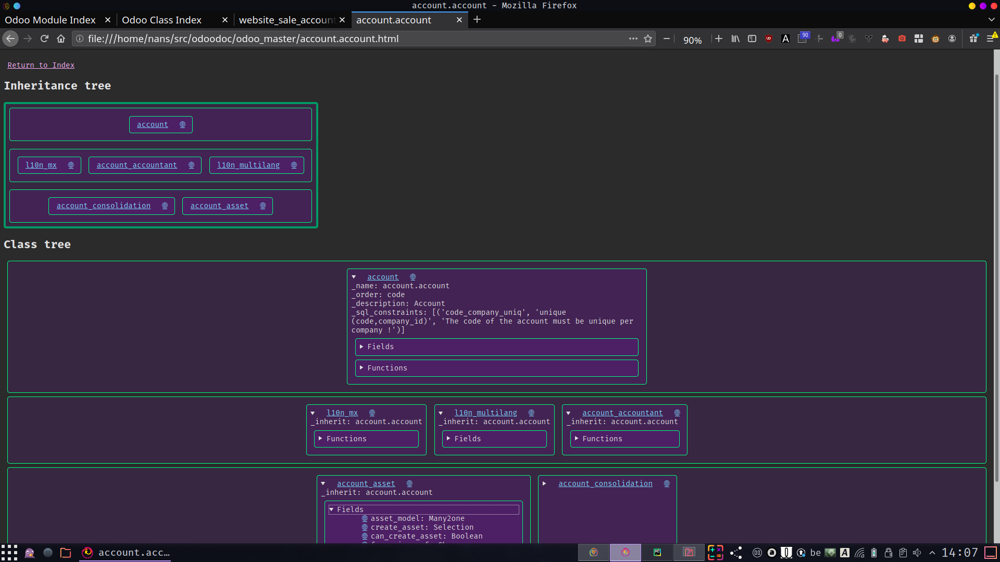

# Pigeoo

Tl;dr: rarefied Doxygen for Odoo.

Automatically generates documentation for Odoo models.
Give an index (`index.*.html`) to the inheritance tree of all Odoo classes and all Odoo modules.

Everything is static for now.
The folder also contains all the information in `.py` files that are dicts
(essentially json) that can be eval'd to be able to easily query any model.

Works for Odoo in Python 3 (so 11.0 and above).

See TODO section: this is more of a stub than a project.



## Install
Needs python 3.8 to run*
The recommended way to install is to use [pipx](https://pipxproject.github.io/pipx/):

```pipx install --python python3.8 pigeoo```

*(it uses `ast`, which changes from version to version.
By switching to [RedBaron](https://github.com/PyCQA/redbaron),
this requirement would be removed)

## Usage
By default, it generate the documentation for Odoo, if found in `.src` folder.
It will generate the documentation with online links (to Github/Gitlab) for all
source folders, and skip it for non-source folders (e.g. pip installs).
Example (generates doc based on pip installation, restricted to two 'top' modules):

```pigeoo -m project_all,project_all_enterprise -p /home/user/src/project/odoo/addons,/home/user/.virtualenvs/project/lib/python3.6/site-packages/odoo/addons -o project_doc```

The branches should be clean, i.e. up-to-date against the online version,
so that online links work. Otherwise line numbers, or even file paths will be wrong.
Unexpected things might cause arbitrary crashes, so stay clean.*

Use `-h` or `--help` to get all script arguments:
 - `output_path, -o`: folder for the documentation (defaults to `odoo_'branch_name(s)'`)
 - `paths, -p`: paths for the Odoo addons (defaults to `~/src/odoo,~/src/enterprise`)
 - `local, -l`: if true, the documentation contains links to the files on the filesystem.
 - `modules, -m`: if set, the documentation is restricted to modules in the dependency tree of the argument. Otherwise, all modules in path are processed.

 Note that the path argument needs to be the absolute path
(using `~` works, but relative paths don't (on the TODO list)).

*this script has been tested on all supported stable versions of Odoo.
Some special cases have been added on a case by case basis depending on the codebase.
An example is that there is one class which _name is not an instance of str;
this needed two lines of code to tolerate that deviancy.
Weird things in custom code might thus kill the script. PR/forks welcome!

## TODO:
This parser is the first building block in having code assistance for Odoo.
It's born from the observation that within Odoo itself, the only tool that is used is grep.
As a result, sometimes a non-existing field is called,
or it is called from a module which does not depend on the module defining it, etc.
And with function or fields with a generic name, it's a pain to work.
Code is not mere text, it's structured data.
The next steps would be:
 - dynamic React frontend search (with a lightweight server)
 - style type of fields (colours, ...) etc. (for constraints? they are unreadable)
 - parse more information (decorators, args, ...)
 - get ending lineno  => embed source code => get full code with inheritance for a given function
   (should then store this information in a database, as it would be huge)
 - IDE integration
 - ...

## Comments

One goal was to keep things as minimal as possible,
however the resulting code is spartan.
Typing was introduced as a way to simplify reasoning about the code,
however this specific project seems to go against each of its limits
(support for lxml, basic algebraic data types). So it goes.
